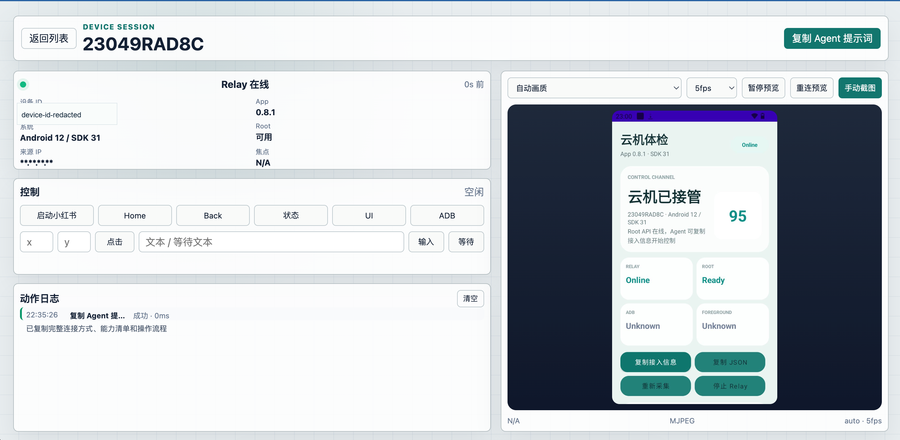
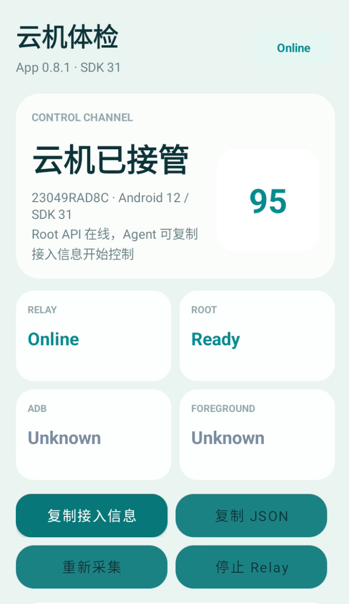

# Android Remote Control

Android Remote Control is an open-source remote control stack for rooted Android devices and cloud phones. It combines a lightweight Kotlin Android app, a token-protected Node.js relay, a React web console, and local CLI helpers for controlled Android automation.

The project is designed for owned devices, lab devices, cloud phones, QA automation, device diagnostics, and remote Android operations where you need screenshots, UI dumps, taps, swipes, text input, app launch, and optional ADB bridging without exposing a public ADB port.

<p>
  
</p>

<p>
  
</p>

## Keywords

android remote control, android automation, rooted android controller, cloud phone control, android adb bridge, android mjpeg streaming, android device dashboard, remote android screenshots, uiautomator dump, kotlin android diagnostics, node websocket relay, react device console

## What It Includes

- **Android app**: Kotlin + XML/View app that connects back to a relay, reports device diagnostics, checks root, handles whitelisted control commands, captures screenshots, dumps UI XML, and opens an ADB tunnel when enabled.
- **Relay server**: Node.js HTTP/WebSocket service that registers devices, accepts token-authenticated commands, streams MJPEG previews, and bridges local ADB traffic through WebSocket.
- **Web console**: Vite + React dashboard for device lists, live-ish screen preview, action logs, screenshots, UI dumps, and copy-ready Agent instructions.
- **CLI helpers**: Local Node scripts for calling the Root API and exposing an ADB bridge on `localhost`.

## Core Capabilities

- Device inventory and heartbeat status
- Root availability checks
- System diagnostics and JSON report generation
- Screenshot capture as PNG/JPEG/WebP
- MJPEG browser preview with adaptive quality
- UI XML dump through uiautomator
- Whitelisted input actions: tap, long press, swipe, back, home, input text, clear text
- App launch through a server-side package allowlist
- Optional ADB bridge over token-protected WebSocket
- Web console with device list, phone preview, action log, and Agent prompt copy

## Safety Model

This repository does **not** provide an arbitrary shell API. Commands are fixed and whitelisted. The relay requires a shared token, and ADB is tunneled through the relay instead of opening a public ADB port.

Use this only on devices you own or are authorized to control. Do not use it for stealth control, unauthorized automation, credential theft, or bypassing platform policies.

## Repository Layout

```text
app/                    Kotlin Android app
cloudphone-relay/       Node.js relay server
cloudphone-console/     React web console
tools/                  Local Root API and ADB bridge helpers
gradle/                 Android Gradle wrapper
```

## Configuration

Do not hardcode production URLs or tokens into source code. Use environment variables or Gradle properties.

### Android build config

Pass these values through environment variables or Gradle properties:

```bash
export CLOUDPHONE_RELAY_URL='wss://your-domain.example/cloudphone-relay/ws/device'
export CLOUDPHONE_RELAY_TOKEN='replace-with-a-long-random-token'
export CLOUDPHONE_UPDATE_HOST='your-domain.example'

./gradlew assembleDebug
```

The app reads:

- `CLOUDPHONE_RELAY_URL`: device WebSocket endpoint
- `CLOUDPHONE_RELAY_TOKEN`: shared relay token
- `CLOUDPHONE_UPDATE_HOST`: host allowed for self-update APK downloads

### Relay server

```bash
cd cloudphone-relay
npm install

export RELAY_TOKEN='replace-with-a-long-random-token'
export PORT='18088'
export UPDATE_URL_PREFIX='https://your-domain.example/download/'

npm start
```

Relay endpoints:

- `GET /health`
- `GET /devices`
- `POST /commands`
- `GET /commands/{id}`
- `GET /stream/mjpeg/{deviceId}`
- `GET /adb/tunnels`
- WebSocket `/ws/device/{deviceId}`
- WebSocket `/adb/client/{deviceId}`
- WebSocket `/adb/device/{deviceId}/{tunnelId}`

### Web console

```bash
cd cloudphone-console
npm install
npm run build
```

Deploy `cloudphone-console/dist` under your web root, for example:

```text
https://your-domain.example/cloudphone-console/#token=<relay-token>
```

The console calls the relay through the same origin path:

```text
/cloudphone-relay/*
```

## CLI Usage

Set connection variables:

```bash
export CLOUDPHONE_RELAY_URL='https://your-domain.example/cloudphone-relay'
export CLOUDPHONE_RELAY_WS_URL='wss://your-domain.example/cloudphone-relay'
export CLOUDPHONE_RELAY_TOKEN='replace-with-a-long-random-token'
export CLOUDPHONE_DEVICE_ID='your-device-id'
```

Call the Root API:

```bash
node tools/cloudphone-api-client.mjs devices
node tools/cloudphone-api-client.mjs cmd snapshot
node tools/cloudphone-api-client.mjs cmd launch_xhs
node tools/cloudphone-api-client.mjs cmd screencap '{"format":"jpeg","maxWidth":540,"quality":65}'
node tools/cloudphone-api-client.mjs cmd dump_ui
node tools/cloudphone-api-client.mjs cmd tap '{"x":360,"y":720}'
node tools/cloudphone-api-client.mjs cmd swipe '{"x1":360,"y1":1050,"x2":360,"y2":420,"durationMs":450}'
node tools/cloudphone-api-client.mjs cmd input_text '{"text":"hello"}'
node tools/cloudphone-api-client.mjs cmd wait_for_text '{"text":"Search","timeoutMs":5000}'
```

Start an ADB bridge:

```bash
node tools/cloudphone-api-client.mjs cmd adb_enable
node tools/cloudphone-api-client.mjs cmd adb_status
node tools/adb-bridge-client.mjs --device "$CLOUDPHONE_DEVICE_ID" --port 15555
adb connect localhost:15555
adb shell wm size
```

## Agent Prompt Support

The web console can copy a complete Agent prompt for the selected device. It includes the relay URL, token usage, device ID, command protocol, Root API command list, CLI examples, ADB bridge instructions, recommended control flow, and safety boundaries. This lets another AI Agent connect and operate without guessing the API.

## Command Protocol

Create a command:

```http
POST /cloudphone-relay/commands
Content-Type: application/json
x-relay-token: <relay-token>
```

```json
{
  "deviceId": "your-device-id",
  "name": "screencap",
  "params": {
    "format": "jpeg",
    "maxWidth": 540,
    "quality": 65
  }
}
```

Poll the command result:

```text
GET /cloudphone-relay/commands/{id}
```

Command status is one of:

- `queued`
- `sent`
- `completed`
- `failed`
- `offline`

## Notes

- Root is required for most control commands.
- MJPEG preview is built on repeated screenshots; it is useful for observation but is not a replacement for hardware video encoding.
- ADB bridge support depends on the device allowing root control over `adbd`.
- Package launch is intentionally allowlisted in the relay server.
